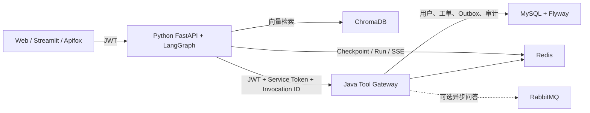

# Enterprise QA Agent：企业知识库与工单执行智能体

这是一个面向 AI 应用开发岗位的可运行项目：Python + LangGraph 负责编排、状态恢复、人工审批和流式事件；Java Spring Boot 负责用户鉴权、业务规则、MySQL 与内部工具网关；ChromaDB 提供企业文档语义检索。

项目重点不是“套一个聊天页面”，而是展示 Agent 在真实业务系统中的几个关键问题如何落地：身份传递、工具权限、写操作审批、幂等执行、故障恢复、审计记录和可回归评测。

## 核心能力

- 显式 `StateGraph`：输入校验 → 规划 → 工具路由 → 人工审批 → 执行 → 汇总。
- RAG 检索：保留原有文档切分、DashScope Embedding 与 ChromaDB 检索链路。
- Human-in-the-loop：创建/修改工单、生成通知必须经过 LangGraph `interrupt`。
- 可恢复运行：生产模式使用 Redis checkpointer，运行元数据和 SSE 事件同样写入 Redis。
- 双重认证：Python 校验用户 JWT；Java 内部工具网关再次校验 JWT 和独立服务令牌。
- 身份不可伪造：Java 只使用 JWT 解析出的 `userId`，拒绝模型在工具参数中传入身份或令牌。
- 幂等与审计：每次 Java 工具调用携带唯一 `invocationId`，数据库阻止重复副作用并保存结果。
- 向后兼容：原 Java 同步/异步问答接口和 Python `/api/rag/*` 接口继续保留。
- Agent 评测：数据集覆盖知识查询、用户信息、工单查询、创建、更新、通知及审批策略。

## 系统架构



### LangGraph 执行路径

```text
validate_input
      ↓
   planner ───────────────→ finalize
      │                         ↑
      ├─ 读取工具 → execute_read ┘
      │
      └─ 写入工具 → interrupt/approval
                         ├─ 拒绝 → finalize
                         └─ 批准 → execute_write → planner
```

模型只负责生成受约束的规划结果。实际工具名必须位于白名单，工具参数不能包含 `userId`、Token、SQL、Shell 或动态 URL。访问令牌通过 LangGraph runtime context 传递，不写入 checkpoint。

## 技术栈

| 层 | 技术 |
|---|---|
| Agent | Python 3.11、LangGraph 1.2、LangChain 1.3、FastAPI、Pydantic |
| 状态与事件 | Redis Checkpointer、Redis Run Store、Redis Streams、SSE |
| RAG | ChromaDB、DashScope Embeddings、PDF/TXT 文档加载 |
| 业务后端 | Java 17、Spring Boot 4、MyBatis、JWT、Flyway |
| 数据与消息 | MySQL 8、Redis、RabbitMQ |
| 工程验证 | pytest、JUnit、策略评测集、Docker Compose |

## 目录

```text
enterprise-qa-platform/
├─ ragagent/
│  ├─ agent/                 # StateGraph、planner、policy、checkpoint、events
│  ├─ api/                   # Agent API 与兼容 RAG API
│  ├─ clients/               # Java Tool Gateway 客户端
│  ├─ persistence/           # Memory/Redis Run Store
│  ├─ security/              # Java 兼容的 HS256 JWT 校验
│  ├─ evals/                 # Agent 路由与审批评测集
│  └─ tests/                 # 单元与图集成测试
├─ aiLLL/
│  └─ src/main/
│     ├─ java/.../controller/internal/AgentToolController.java
│     └─ resources/db/migration/  # Flyway V1/V2
├─ docker-compose.yml
└─ docs/
```

## 一键启动

前置条件：Docker Desktop / Docker Engine + Compose。

```powershell
Copy-Item .env.example .env
# 编辑 .env，至少填写 MySQL 密码、JWT_SECRET、AGENT_SERVICE_TOKEN；
# 需要真实模型和向量检索时再填写 DASHSCOPE_API_KEY / LLM_API_KEY。

docker compose up --build
```

启动后：

- Java API：`http://127.0.0.1:8080`
- LangGraph Agent：`http://127.0.0.1:8001`
- Agent OpenAPI：`http://127.0.0.1:8001/docs`
- RabbitMQ 管理页：`http://127.0.0.1:15672`

Flyway 会在 Java 首次启动时自动创建/升级表，不需要手工复制 SQL 到 DataGrip。已有非空旧库会建立版本 1 基线，再执行 `V2__agent_tool_gateway.sql`；全新数据库会依次执行 V1、V2。

详细步骤见 [本地启动指南](docs/startup.md)，接口见 [API 文档](docs/api.md)，设计取舍见 [Agent 设计说明](docs/agent-design.md)。

## 测试

```powershell
# Python Agent、HITL、策略和鉴权
.\.venv\Scripts\python.exe -m pytest ragagent\tests -q

# Java JWT 与构建测试
Set-Location aiLLL
.\mvnw.cmd test
```

当前自动化覆盖：读取工具无需审批、写工具暂停与恢复、拒绝不产生副作用、JWT 兼容、身份参数防篡改、API 401 边界和 7 类规划评测用例。

## 安全设计

- 仓库不保存 `.env`、数据库密码、JWT 密钥或 DashScope Key。
- Python 和 Java 都验证用户 JWT；内部接口还要求 32 字节以上的服务令牌。
- Java 不相信 Agent 传入的用户身份，只读取拦截器写入的认证上下文。
- 写工具默认暂停；通知只进入 `notification_outbox`，当前版本不会擅自发送外部邮件。
- `agent_tool_execution.invocation_id` 是主键；相同调用无法重复创建工单。
- `/api/rag/index` 默认关闭，需要明确设置 `RAG_ALLOW_INDEXING=true` 才可写向量库。
- 只输出执行摘要和工具事件，不保存或展示模型隐藏推理过程。

## 当前边界

- 本项目未提供生产邮件消费者；Outbox 仅用于展示安全的异步副作用边界。
- 本地无 DashScope Key 时，Agent 使用确定性规划降级，便于测试；配置 Key 后 `auto` 模式优先使用结构化模型规划。
- Streamlit 是演示客户端，正式产品可复用 REST + SSE API 接入任意前端。
